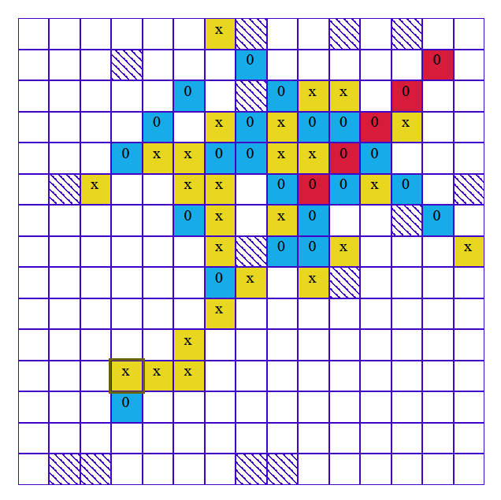

# Tic-Tac-Toe
This is custom implementation with minor improvements of a popular board game "Five in a row"(or "Gomoku", or tic-tac-toe an enlarged board). Where you play against AI. 

Try it here: https://game-five-in-a-row.herokuapp.com/ (Maybe it will be necessary to wait a bit before game starts)



## How to play?
The aim of the game is to form a sequence of 5 (or more) noughts or crosses in a row (vertically, horizontally or diagonally).

Two players make actions one by one (placing cross or nought in any free cell on a board). 
The player who creates such sequence first wins the game.

## How to run?
Backend written in kotlin with `java 11`. Probably can be build and run on highest java versions.
Frontend written with `Angular 13`.

There are two game modes: console and web.
1. Console mode. It developed mostly for local testing, so more mistakes can be found. 
    1. Enter root directory `cd tic-tac-toe`
    2. Build whole application `mvnw clean package`
    3. Run console app 
      ```
      cd tic-tac-toe-console/target
      java -jar tic-tac-toe-console-0.1.0-jar-with-dependencies.jar
      ```
   4. Enjoy the game! Be careful setting the high difficulty level. It can be slow.
2. Web mode.
   1. Enter root directory `cd tic-tac-toe`
   2. Build whole application `mvnw clean package`
   3. Start ui
      ```
      cd tic-tac-toe-frontend
      ng serve --open
      ```
   4. Start backend api
      ```
      cd tic-tac-toe-web/target
      java -jar tic-tac-toe-web-0.1.0-jar-with-dependencies.jar
      ```
   5. Enjoy the game! To make it more interesting you can add obstacles on a board by selecting obstacles checkbox on ui.
## AI algorithm
The AI is created with minimax algorithm and alpha-beta pruning.

## A bit about repository structure. 
Repository contains multiple modules where main module with all game logic is `tic-tac-toe-core`. 

`tic-tac-toe-console` and `tic-tac-toe-web` can be considered as different clients for core module which allow to play through different interfaces.

`tic-tac-toe-frontend` contains web ui written with Angular.

`tic-tac-toe-repository` is a development for future to allow play the game with another person.

##  Bugs, improvements
Just create an issue or PR for any reason.